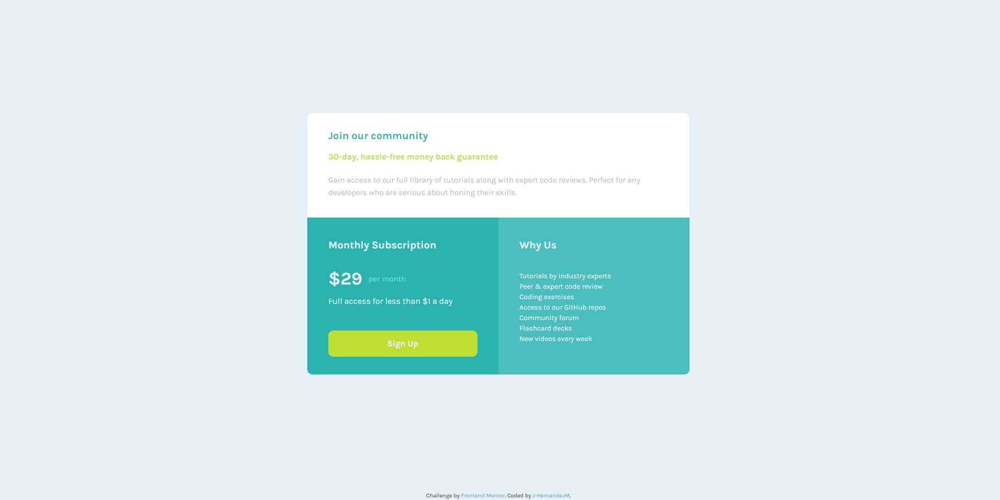

# Frontend Mentor - Single price grid component solution

Esta es una solucion al reto [Single price grid component challenge on Frontend Mentor](https://www.frontendmentor.io/challenges/single-price-grid-component-5ce41129d0ff452fec5abbbc).

## Tabla de contenidos

- [Descripcion](#descripcion)
  - [El desafio](#el-desafio)
  - [Screenshot](#screenshot)
  - [Links](#links)
- [Mi proceso](#mi-proceso)
  - [Hecho con](#hecho-con)
  - [Lo aprendido](#lo-que-aprendi)
  - [Aprendiendo](#en-continuo-aprendizaje)
- [Autor](#autor)

## Descripcion

Esta es mi propuesta de solucion al desafio crear un componente de precio sensillo usando CSS GRID. 

## El desafio

El usuario deberia poder:

- Ver el layout optimo dependiendo de su tamano de pantalla.
- Ver la interaccion cuando se coloca el mouse encima de los elementos.

## Screenshot

## Links

- Solucion: [GITHUB](https://github.com/J-HernandezM/single-price-grid)
- Live site: [PAGES](https://j-hernandezm.github.io/single-price-grid/)

## Mi proceso

En este caso como ya llevaba varios retos completados lo termine en un mejor tiempo, empleando con mas agilidad las propiedades de CSS GRID que me permitian maquetar con mayor facilidad el componente.\
Utilice para la card principal medidas en porecntajes y les puse maximos y minimos para que no se deforme o se expanda demasiado al cambiar en las diferentes pantallas

## Hecho con

- Semantic HTML5 markup
- CSS custom properties
- Flexbox
- CSS Grid
- Mobile-first workflow

## Lo que aprendi

Mejore e interiorice mas practicar con el CSS GRID y su flujo de trabajo para tener layouts mejor realizados y en menor timepo.
Ademas aprendi a aplicar corrtente la pseudo clase nth-child la cual aun no comprendia del todo bien

## En continuo aprendizaje

Me gustaria mejorar mas y tener una mayor agilidad a la hora de maquetar paginas web usando CSS GRID. Practicare mas en ello y de ser posible en paginas dinamicas y con funcionalidades.

## Autor

- Website - [Portfolio en construccion](https://j-hernandezm.github.io)
- Frontend Mentor - [@J-HernandezM](https://www.frontendmentor.io/profile/J-HernandezM)
- Github - [@J-HernandezM](https://github.com/J-HernandezM)
- Twitter - [@__HernandezM](https://www.twitter.com/__HernandezM)

